## Definition

A parameterised quantum circuit used to:
- Generate trial wave functions
- Explore Hilbert space
- Encode problem structure

## Key Components

```mermaid
graph LR
    A[Ansatz] --> B[Parameters θ]
    A --> C[Quantum Gates]
    A --> D[Entanglement]
```

## Common Types

### 1. Hardware-Efficient Ansatz

- Uses native gate set
    
- Minimal SWAP operations
    
- Example:

### 2. Unitary Coupled Cluster (UCC)

- For chemistry problems
    
- Derived from Hartree-Fock
    
- Exponential of excitations
    

### 3. Quantum Alternating Operator (QAOA)

- Mixing + Problem Hamiltonians
    
- p-layer structure
    
- Common for combinatorial problems
    

## Design Considerations

### Expressibility

- How much of Hilbert space is reachable
    
- Tradeoff with trainability
    

### Entanglement

- Controlled by CNOT placement
    
- Crucial for correlation effects
    

### Parameterization

- Single-qubit rotations (RY, RZ)
    
- Typically angle parameters