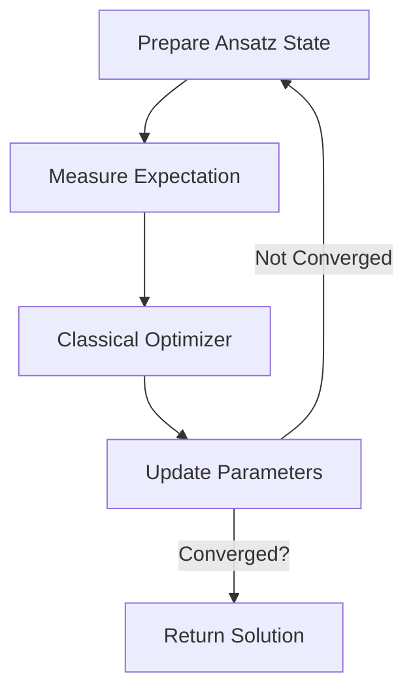

---
## Overview

Hybrid quantum-classical algorithm for finding ground state energies (optimal solutions) by:
1. Preparing quantum states with parameterised circuits
2. Measuring expectations
3. Classically optimising parameters

## Algorithm Flow




## Key Components

### 1. Ansatz Circuit

Parameterised quantum circuit that explores solution space:

### 2. Cost Function

For portfolio optimisation:

```math
H = \lambda \mathbf{w}^T\Sigma\mathbf{w} - \mathbf{\mu}^T\mathbf{w}
```

where λ = risk aversion parameter

### 3. Classical Optimizer

Common choices:

- COBYLA
    
- SPSA
    
- Gradient descent

## Advantages

1. Noise resilience (NISQ-friendly)
    
2. Fewer qubits required vs QPE
    
3. Hybrid approach mitigates decoherence

## Limitations

1. Barren plateaus in optimization
    
2. Ansatz design sensitivity
    
3. Classical optimiser convergence